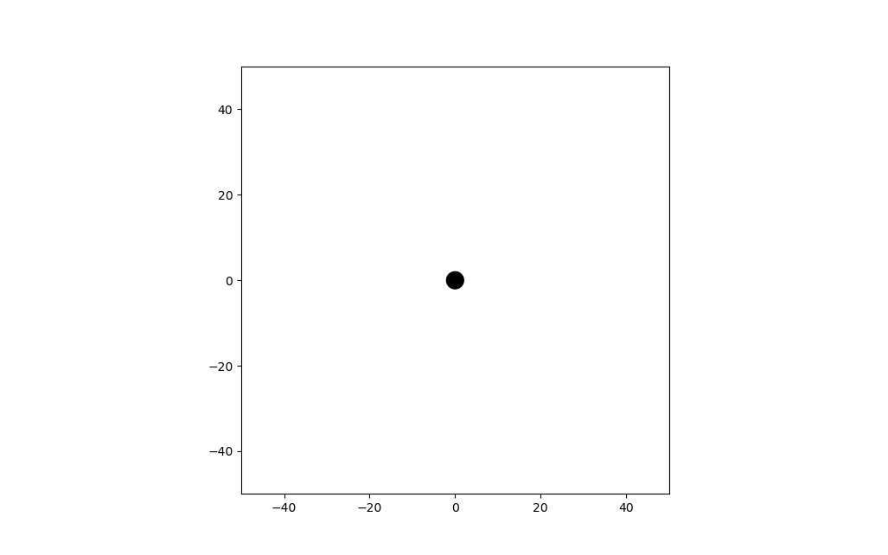

# Black_Holes_Work

This project numerically integrates geodesic equations in Schwarzschild,spacetime
using a 4th-order Runge–Kutta method and visualizes particle motion near a black hole.

## Features
- Symbolic construction of the Schwarzschild metric
- Automatic computation of Christoffel symbols
- Numerical integration of timelike geodesics
- Coordinate-space visualization and animation
- Event horizon visualization

## Units
Natural units are used: G = c = M = 1.

## Example
A massive particle falling toward a Schwarzschild black hole:

## Future Work
- Photon geodesics
- Kerr (rotating) black holes
- Proper distance coordinates
- Accretion disk visualization
